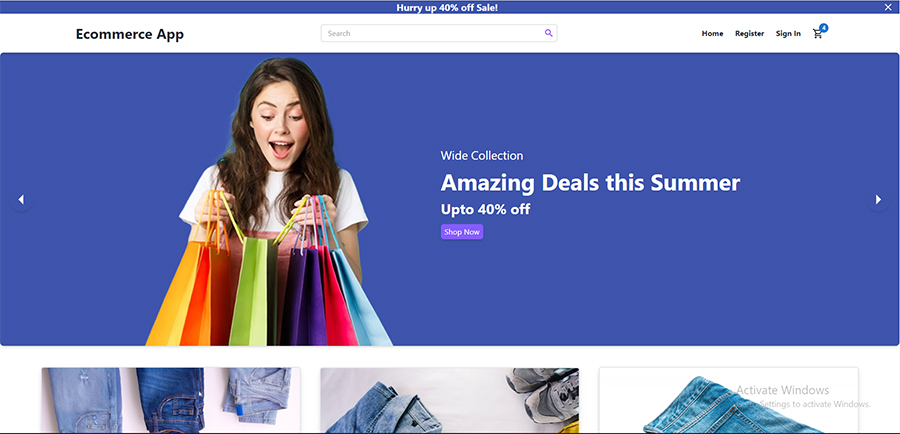

# A awesome Ecommerce App with React, Redux, Tailwindcss & Material-UI
### Full Mobile Responsive App

#### Go to Live Project: https://ecommerce-store-react-redux-taildwind.netlify.app/

### Full Mobile Responsive Web Page

#### Add image with link in Readme Directory:

### What I use here:
* React
* Tailwindcss
* Material-UI
* material-Icons

#### To start a new Create React App project:

    npx create-react-app my-app
    yarn create react-app my-app

### For install Tailwind you have to follow 4 steps, such as...

#### Installing Tailwindcss:

    npm install -D tailwindcss

#### Generating tailwind.config.js file:

     npx tailwindcss init

#### Configure template paths
#### Add the paths to all of your template files in your tailwind.config.js file:

    content: [
      "./src/**/*.{js,jsx,ts,tsx}",
    ],
  
 #### Add the Tailwind directives to CSS File:
    @tailwind base;
    @tailwind components;
    @tailwind utilities;
 
 ### Installing Material-UI:
    npm install @mui/material @emotion/react @emotion/styled

 ### Installing Material-Icon:
    npm install @mui/icons-material

#### Redux Toolkit is available as a package on npm or yarn:

    npm install @reduxjs/toolkit
    yarn add @reduxjs/toolkit
    
#### React-Redux package:
    npm install react-redux
    yarn add react-redux
 
